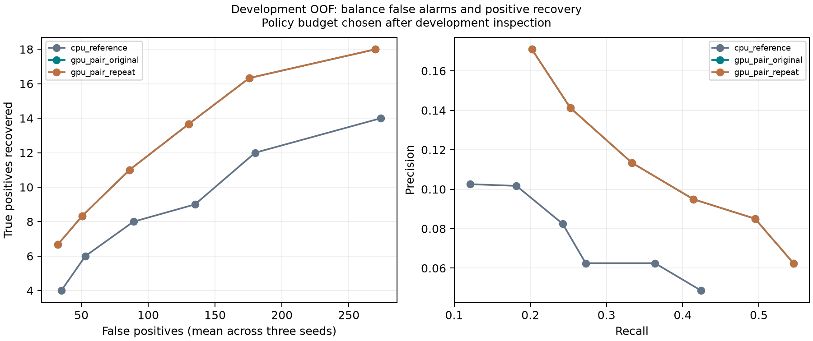
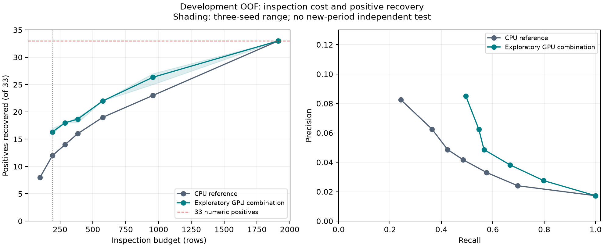

# 과제 1번 — 로컬 GPU 학습과 결과 검증

2026-10-04 · NVIDIA GTX 1650 4GB · 공식 사출성형 CSV 네 개 · 숫자 라벨 `PassOrFail=1` 기준.

## 결과

사용자의 오탐·정밀도·정확도 균형 우선 요청에 따라, 최종 연구 권장안은 **CN7 로지스틱 C=1 + RG3 CatBoost row/event 순위 평균, 설비별 상위 7.5% 검사**다. 총 **144건(CN7 73, RG3 71)**을 검사하여 세 seed **14/14/13건**을 찾았다. 동일 조건으로 GPU를 다시 적합한 두 실행에서 같은 집계 결과를 확인했다. 33건 전체 포착을 위한 대량 검사 경로는 채택하지 않았다.

| 경로 | 검사량 | 발견 TP | 오탐 FP | 재현율 | 정밀도 | F1 | 정책 파생 정확도 |
| --- | --- | --- | --- | --- | --- | --- | --- |
| 기존 CPU 기준선 | 192 | 12 | 180 | 36.36% | 6.25% | 10.67% | 89.49% |
| 같은 검사량의 CPU 기준선 | 144 | 9 | 135 | 27.27% | 6.25% | 10.17% | 91.69% |
| **GPU 균형 후보, 각 seed** | **144** | **13–14** | **130–131** | **39.39–42.42%** | **9.03–9.72%** | **14.69–15.82%** | **92.11–92.21%** |
| **GPU 균형 후보, 세 seed 점수 평균** | **144** | **13** | **131** | **39.39%** | **9.03%** | **14.69%** | **92.11%** |

기존 K192 기준선보다 검사량 25%, 오탐 27.22–27.78%를 줄이며 1–2건을 더 찾았다. 같은 K144끼리 비교해도 GPU가 4–5건 더 찾고 오탐을 4–5건 줄였다. 세 seed 평균 기준 CN7은 10/13, RG3는 3/20을 찾았다. 검사 경계의 동률 순서를 바꿔도 각 실행에서 최소 13건이다.

검사 비율 2/3/5/7.5/10/15%를 비교하고, 두 GPU 실행의 모든 seed와 세 seed 평균이 기존 기준선의 12건 이상을 유지하면서 정밀도·F1을 높이고 오탐을 줄이는 가장 낮은 비교 비율을 골랐다. 5%(K97)는 평균 11건·정밀도 11.34%·F1 16.92%로 더 높은 정밀도 대신 누락이 늘었다. 10%(K192)는 평균 16건·정밀도 8.33%·F1 14.22%다. **7.5%는 이 개발 데이터에서 선택한 절충점이며, 현장 최적 임계값이나 미래 성능 보장은 아니다.**



### 참고: 같은 192건 검사량의 모델 비교

같은 설비별 상위 10% 검사량 **K=192**에서 CPU 로지스틱 기준선은 양성 12/33건을 찾았다. GPU 조합은 세 seed **16/17/16건**이다.

| 모델 | 발견 TP | 재현율 | 정밀도 | F1@192 | 정책 파생 정확도 |
| --- | --- | --- | --- | --- | --- |
| CPU 기준선, 모든 seed | 12/33 | 36.36% | 6.25% | 10.67% | 89.49% |
| GPU 탐색 조합, seed 20260922 | 16/33 | 48.48% | 8.33% | 14.22% | 89.91% |
| GPU 탐색 조합, seed 20260923 | 17/33 | 51.52% | 8.85% | 15.11% | 90.02% |
| GPU 탐색 조합, seed 20260924 | 16/33 | 48.48% | 8.33% | 14.22% | 89.91% |
| GPU 탐색 조합의 세 seed 점수 평균 | 16/33 | 48.48% | 8.33% | 14.22% | — |

세 seed는 고정된 동일 outer 분할에서 모델·inner 분할 seed를 바꾼 것이다. 서로 다른 독립 시험 집합 세 개를 뜻하지 않는다. 조합은 개발 OOF 결과를 본 뒤 만든 **사후 탐색 후보**다. 최고 seed의 17건을 세 seed 앙상블의 성능으로 표기하지 않는다.

| 설비 | 검사 K | 기준선 TP / 양성 | GPU 조합 TP / 양성 | 기준선 → GPU 조합 재현율 | 기준선 → GPU 조합 F1 |
| --- | --- | --- | --- | --- | --- |
| CN7 | 97 | 11/13 | 12/13, 세 seed 공통 | 84.62% → 92.31% | 20.00% → 21.82% |
| RG3 | 95 | 1/20 | 4/20, 5/20, 4/20 | 5.00% → 20–25% | 1.74% → 6.96–8.70% |

설비별 AP와 AUC도 높아졌지만, **전체 AP는 0.115419에서 0.099113–0.103064로 낮아졌다.** 설비별로 서로 다른 점수 척도를 쓰므로 모든 행을 한 점수로 합친 순위의 해석에 제한이 있다. 검사 정책은 설비별 검사량을 배정한다. 그룹 bootstrap 1,000회에서 재현율 차이의 조건부 95% 구간은 −2.86~31.11%p로 0을 포함한다. 모델 탐색 불확실성과 미래 성능까지 검증한 구간은 아니다.



## 33/33과 정밀도 사이의 실제 비용

학습 구간의 inner OOF에서 재현율 100%가 되도록 기준선 임계값을 정하면 outer OOF에서 세 seed 모두 33/33을 발견했다. 그러나 검사량은 **1,427/1,243/1,455건**, 오탐은 **1,394/1,210/1,422건**, 정밀도는 **2.27–2.65%**, F1은 **4.44–5.17%**다. 이를 K192 성능 개선이나 실용적인 완전 탐지로 채택하지 않았다.

GPU 탐색 조합의 검사량을 늘리면 K288에서 18건, K384에서 18/19/19건, K575에서 22건, K957에서 27/25/27건을 찾는다. 모든 1,913행을 검사하면 33건을 포함하나 선별의 이점이 없다. 모든 행을 음성으로 분류해도 정확도는 98.275%이므로 정확도 하나만으로 모델을 선택하지 않는다.

개발 영역 양성 33건 중 **29건은 같은 센서값의 반대 라벨 행과 짝**을 이룬다(CN7 9, RG3 20). 같은 입력에 같은 점수를 주는 센서 기반 모델은 이 두 행을 완벽히 구분할 수 없다. 이상적인 그룹 탐지를 가정해도 재현율 100%에서 오탐은 최소 29건이며 정밀도 상한은 53.23%, F1 상한은 69.47%다. 이는 달성 성능이 아닌 식별 가능성의 이론적 상한이다.

## 학습과 검증

- 공식 CSV 네 파일의 SHA-256과 인계 ZIP 해시를 확인했다. 개발 영역은 1,913행·957그룹·양성 33건이며 과거 노출된 holdout 480행은 학습·평가에서 제외했다.
- Windows/Mac의 그룹 지문 이름 차이는 행 ID·라벨·그룹 구성의 일대일 대응을 확인한 뒤 이름만 정렬했다. 원본 분할 SHA-256 `e26a82c58d0e86952b8557c2e8542f816f64db8ed49d15a4a450ef7a86b5efc7`을 유지했다.
- CPU 기준선 105 fit, 고정 GPU 비교 60 fit, 17종 중첩 비교 1,980 fit(GPU 1,080), 연구 번들 GPU full fit 6회, 마지막 9종 비교 1,020 fit(GPU 840)을 완료했다. 공식 데이터 GPU 적합은 합계 **1,986회**다. XGBoost CUDA·CatBoost GPU 적합 후 백엔드를 검사했다.
- outer 5fold와 각 학습 구간의 inner 3fold로 모델·임계값을 선택했다. class weight, event 학습, 5배 양성 복제는 학습 구간에만 적용했다. 독립된 실제 양성 라벨 수는 33건 그대로다.
- 별도 검증기로 원본·분할·산출물 해시, OOF 행과 라벨, 그룹 분리, 적합 원장, 선택 모델, 임계값 판정, 혼동행렬·재현율·정밀도·F1·정확도·AP·AUC를 재계산했다. 기존 17종 비교는 OOF 126,258행·적합 1,980행·지표 1,782행을 확인했다.
- 연구 번들에서 CN7 가중치와 RG3 native 모델 6개의 저장/복원 추론을 대조했다. 비라벨 71,180행의 대기열은 누락·중복 ID와 유효 점수를 확인했다. 이 데이터의 실제 양성 수와 탐지율은 정답이 없어 측정할 수 없다.

## 마지막 추가 GPU 비교

9종 후보의 센서 비율·온도 차이 특징, 낮은 트리 깊이와 강화된 규제를 추가 비교했다. 모델과 비교 범위는 적합 전에 기록했다. GPU 840 fit을 포함한 1,020 fit이 완료됐으며, 별도 검증기로 inner OOF 206,604행·outer OOF 80,346행·지표 1,134행과 임계값을 재검사했다. 강화된 규제·새 센서 특징 조합은 기존 CatBoost pair를 넘지 못했다. 기존 pair의 K192 결과는 다시 16/17/16이었다.

학습 구간의 inner OOF만으로 설비별 sigmoid 점수 보정도 비교했다. K192에서는 13/13/13건, 전체 AP 0.083076–0.094178로 원래 조합과 기준선보다 낮아 채택하지 않았다. 최종 후보는 기존 모델 구성을 유지하고 검사 예산을 7.5%로 낮춘 균형안이다. 원자료·실제 라벨은 바꾸지 않았다.

## 재실행과 산출물

[전체 설치·원본 해시·분할 복구 및 실행 안내](../GPU_PC_과제01_바로실행_인계_20261004.md)를 따른다. Python 3.12와 `requirements-compare.txt`를 사용하고 각 실행에는 새 출력 폴더를 지정한다.

```powershell
$env:PYTHONUTF8 = '1'
$env:MPLCONFIGDIR = Join-Path (Get-Location).Path 'outputs\matplotlib_cache'
.\.venv-gpu\Scripts\python.exe task01_gpu_nested_search.py --data-dir data/task01_official --split-dir outputs/gpu_pc_split_20261004_03 --output-dir outputs/gpu_pc_refinement_20261004_01 --local-gpu-ack --candidate-set refinement --save-inner-predictions --max-seconds 1800
.\.venv-gpu\Scripts\python.exe verify_task01_gpu_nested.py --data-dir data/task01_official --split-dir outputs/gpu_pc_split_20261004_03 --result-dir outputs/gpu_pc_refinement_20261004_01 --output-dir outputs/gpu_pc_refinement_verify_20261004_01
.\.venv-gpu\Scripts\python.exe task01_gpu_ensemble_probe.py --data-dir data/task01_official --split-dir outputs/gpu_pc_split_20261004_03 --result-dir outputs/gpu_pc_refinement_20261004_01 --output-dir outputs/gpu_pc_refinement_ensemble_20261004_01
.\.venv-gpu\Scripts\python.exe task01_gpu_calibrated_ensemble.py --result-dir outputs/gpu_pc_refinement_20261004_01 --verification-dir outputs/gpu_pc_refinement_verify_20261004_01 --output-dir outputs/gpu_pc_calibrated_20261004_01
.\.venv-gpu\Scripts\python.exe task01_gpu_balance_review.py --output-dir outputs/gpu_pc_balance_20261004_01
.\.venv-gpu\Scripts\python.exe task01_gpu_candidate_bundle.py --data-dir data/task01_official --split-dir outputs/gpu_pc_split_20261004_03 --existing-bundle-dir outputs/gpu_pc_candidate_20261004_01/bundle --inspection-fraction .075 --output-dir outputs/gpu_pc_balanced_queue_20261004_01
.\.venv-gpu\Scripts\python.exe export_task01_gpu_summary.py --output-dir reports/gpu_pc_20261004
```

공개 집계 증빙은 [reports/gpu_pc_20261004](../reports/gpu_pc_20261004)에 있다. 원본·행별 OOF·inner 분할·학습 모델·비라벨 대기열은 로컬 `data/task01_official`와 `outputs`에 보관한다. 번들 경로는 `outputs/gpu_pc_candidate_20261004_01/bundle`, 균형 검사 대기열은 `outputs/gpu_pc_balanced_queue_20261004_01/unlabeled_priority.csv`다. 비라벨 71,180행 중 7.5% 우선 검사 표시는 **5,339행(CN7 2,643, RG3 2,696)**이다. 실제 불량 수는 정답이 없어 알 수 없다. 점수는 불량 확률이 아닌 연구용 검사 우선순위다.

## 최종 판정과 남은 조건

**GPU 학습, 개발 OOF 개선 확인, 오탐을 줄이는 균형 후보 선정과 산출물 수치 검증을 완료했다. 관련 코드·공식 데이터 검사 44개가 모두 통과했다.** K192에서 모든 seed 17건 이상, 33/33과 높은 정밀도의 동시 달성, 새 기간의 독립 성능 검증은 완료하지 못했다. 실제 불량의 0/1 의미와 센서 취득 시점도 확인이 필요하다. 추가 개선에는 샷·제품·캐비티 식별자, 정확한 라벨 대응, 다른 기간의 새 정답 데이터가 필요하다. 기존 품질검사를 유지하며 이 연구 후보로 자동 출하 판정이나 검사 생략을 하지 않는다.
